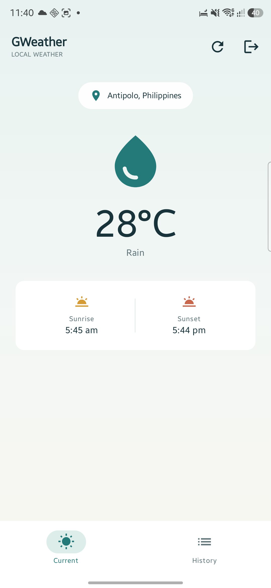

# GWeather

GWeather is an Android weather app that uses the device's location and OpenWeather to show current conditions. It also keeps a local history for each signed-in account.



## Features

- Current temperature, conditions, sunrise, and sunset.
- Optional location access; saved history remains available without it.
- Local account registration and sign-in, with salted password hashes.
- Per-account weather history stored on the device.
- Loading, network, API-key, and permission error states with retry actions.

Accounts and history are stored locally on the device. There is no server-side account recovery or cross-device sync.

## OpenWeather Setup

Set `OPENWEATHER_API_KEY` in the Git-ignored `local.properties` file for Android Studio builds:

```properties
OPENWEATHER_API_KEY=your_key
```

Alternatively, provide it as a Gradle property or environment variable:

```sh
./gradlew assembleDebug -POPENWEATHER_API_KEY=your_key
```

The API key is included in the app package, so treat it as a public client credential. Restrict it and monitor usage in your OpenWeather account. Never commit the key to source control.

## Build and Test

```sh
./gradlew testDebugUnitTest
./gradlew assembleDebug
./gradlew assembleRelease
```

## Architecture Note

Authentication and registration currently access Room directly. Moving account persistence behind repositories and view models would improve separation as the app grows.
